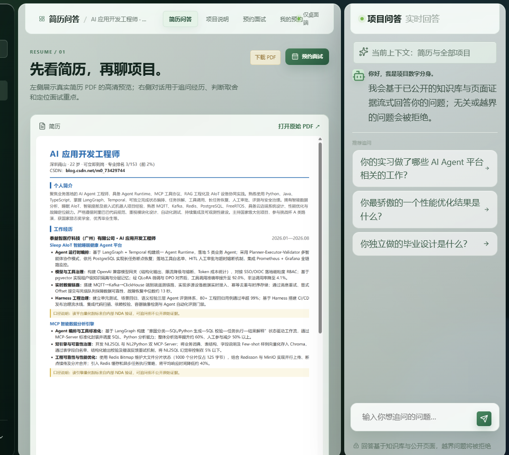
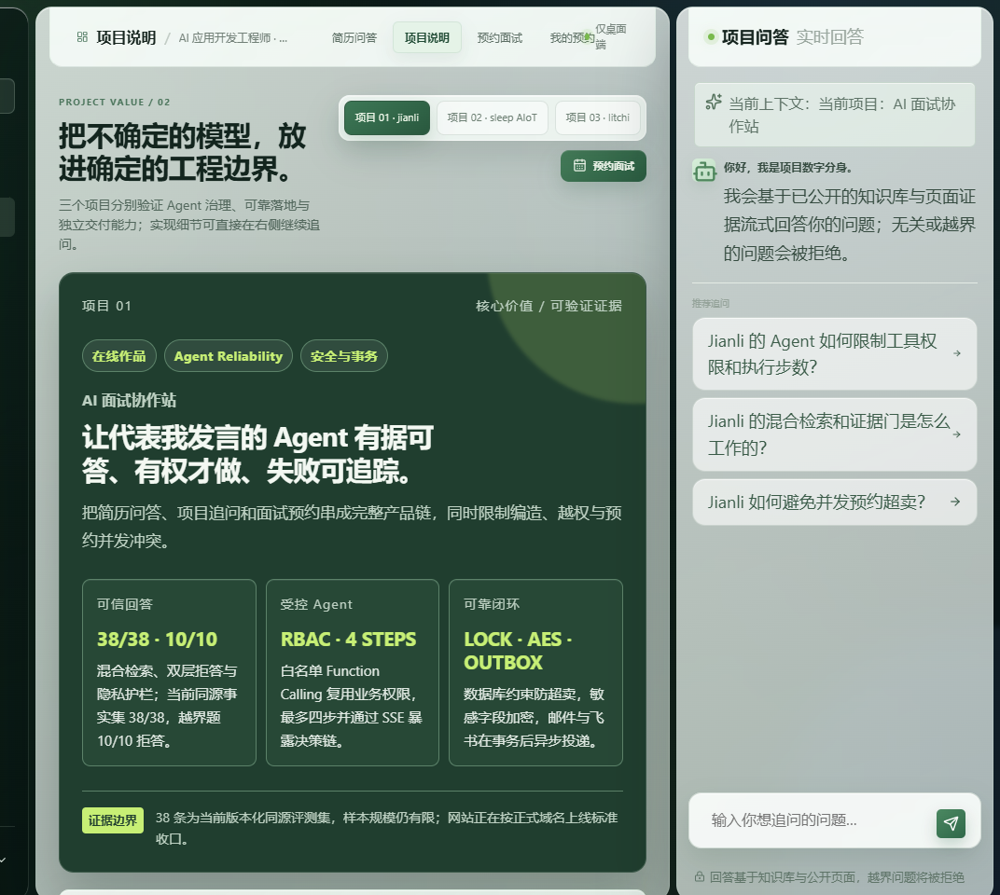
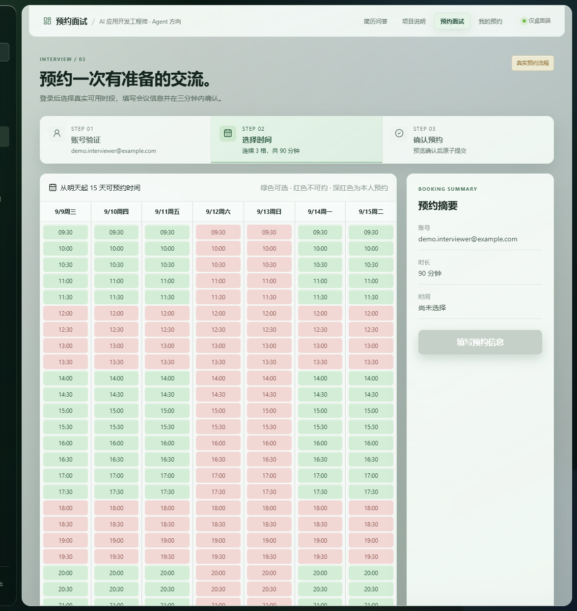
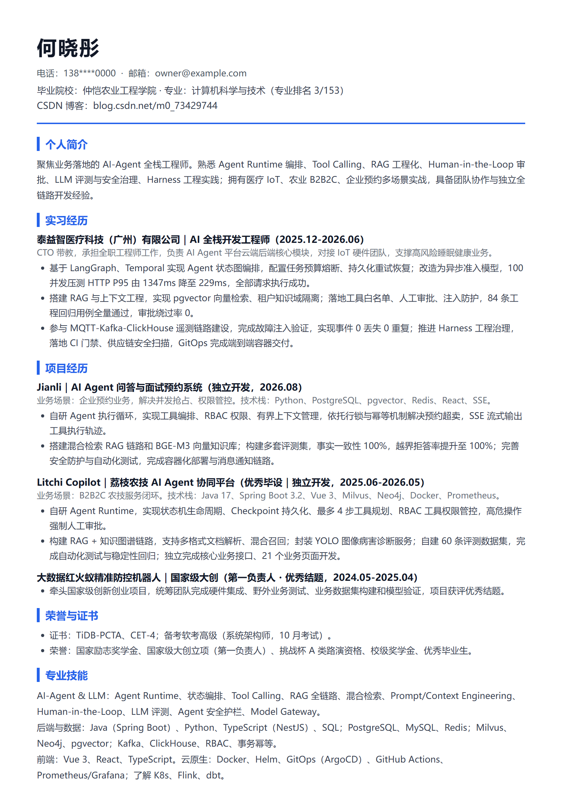

# Jianli · AI Agent 问答与面试预约系统

> 以真实简历为语料的 **Grounded RAG 问答 + 并发安全面试预约 + Agent 工具循环** 一体化全栈系统。React SPA + FastAPI + PostgreSQL/pgvector + Redis，含混合检索 RAG、SSE 流式、Outbox 可靠通知、字段级加密与完整 CI 质量门禁。

[](https://www.python.org/)
[](https://fastapi.tiangolo.com/)
[](https://react.dev/)
[](https://www.postgresql.org/)
[](LICENSE)
[](https://github.com/hxt0227cu-alt/jianli/actions/workflows/agent-quality-gate.yml)

---

## 目录

- [项目定位](#项目定位)
- [核心亮点](#核心亮点)
- [界面预览](#界面预览)
- [可验证结果](#可验证结果)
- [业务闭环](#业务闭环)
- [技术难点](#技术难点)
- [架构图](#架构图)
- [仓库结构](#仓库结构)
- [快速开始](#快速开始)
- [关键接口](#关键接口)
- [复现验证](#复现验证)
- [安全边界](#安全边界)
- [部署](#部署)
- [文档导航](#文档导航)
- [贡献指南](#贡献指南)
- [License](#license)

---

## 项目定位

Jianli 面向「求职者在线简历 + 面试预约」业务场景，是一个**生产级全栈参考实现**，而非教程 demo：

- **访客侧**：浏览脱敏简历 PDF，通过 AI 问答追问项目经历（Grounded RAG，无依据即拒答）；
- **面试官侧**：登录后按动态时段（连续 3 格 / 90 分钟）预约、改期、取消面试，并发安全不超卖；
- **系统侧**：通知经 Outbox 可靠投递（邮件 + 飞书双通道），管理端可看预约、知识库、统计；
- **工程侧**：单仓库模块化架构，配套 AI 治理流程（任务单驱动、SSOT、双角色审查、CI 门禁）。

## 核心亮点

- **Grounded RAG**：BGE-M3 向量（pgvector 1024 维）+ BM25 混合检索，RRF 融合，可选 Qwen3-Reranker 精排；最小相似度证据门把关，无依据 `offtopic=true` 拒答，**不编造**。
- **自研 Agent 执行循环**：工具白名单（知识检索 / 预约 CRUD）+ RBAC，模型只输出意图，服务端二次校验后复用同一套事务，最多 4 步。
- **并发安全预约**：时段物化 + 统一锁顺序 L0→L3 + 行锁 + 幂等键 + 乐观版本号，高并发用例真实覆盖。
- **Outbox 可靠通知**：业务事务同库写事件，独立 Worker 重试 / 超时回收，邮件 + 飞书双通道。
- **纵深安全**：AES-256-GCM 字段级加密、CSRF、限频、CORS 白名单、RBAC、日志扫 PII。
- **可验证质量**：pytest / ruff / mypy / Vitest / Playwright / 迁移 up-down / RAG 评测回归，CI 三 job 串行门禁。

## 界面预览

**① 简历问答页** —— 左侧脱敏简历 PDF 预览，右侧 RAG 流式追问（引用来自命中片段，越界拒答）：



**② 项目说明页** —— 三个项目的核心价值与可验证证据，可继续追问实现细节：



**③ 面试预约选时页** —— 登录后按动态时段选连续 3 格（90 分钟），绿色可选 / 红色不可约，右侧预约摘要：



**④ 脱敏示例简历** —— 仓库内置的演示素材（个人信息已隐藏）：



完整前端含简历问答、项目说明、面试预约、我的预约、知识库管理五类页面。

## 可验证结果

评测报告 `apps/web/evals/latest.json`（对应 verified_commit `4643ffd`）汇总：

| 套件 | 通过 / 总数 | 证据 |
|------|------------|------|
| 总体门禁 | **79 / 79** | 本地等价 CI 全绿 |
| Agent / Trace 回归 | 22 / 22 | pytest `test_agent_lab` + `test_agent_tools` + `test_aiqa` |
| RAG 事实一致性 | **38 / 38** | 真实知识库 + BGE-M3/pgvector 复验；reject 10/10、extreme 9/9 硬断言通过 |
| Web 交付门禁 | 1 / 1 | Vitest + TypeScript + production build |
| Cross-Encoder 协议与降级 | 4 / 4 | 真实候选重排、失败回退、最小请求与越界响应 |
| 语义缓存与 Provider 熔断 | 8 / 8 | 跨进程 grounded 缓存、熔断、恢复窗口 |
| 多台共享令牌 | 6 / 6 | Redis Lua 跨实例计数、断连本地降级 |

**检索质量对比**（真实 Qwen3-Reranker-8B，5 样本）：

| 方案 | MRR | Hit@1 |
|------|-----|-------|
| RRF（向量 + BM25） | 0.3333 | 0 / 5 |
| RRF → Cross-Encoder 精排 | **1.0000** | **5 / 5** |

> 数据来源：`apps/web/evals/latest.json`，由 `scripts/validate_eval_report.py` 校验 freshness 与 79 项断言。

## 业务闭环

```
访客打开站点
   │
   ├─ 浏览简历 PDF ──▶ 提问 ──▶ RAG 检索（向量+BM25+证据门）
   │                                    │
   │                          ┌─────────┴─────────┐
   │                          ▼                   ▼
   │                     有依据：流式引用      无依据：offtopic 拒答
   │                          │
   │                          ▼
   │                     面试官登录（/auth/login）
   │                          │
   │                          ▼
   │                     选连续 3 格（90 分钟）
   │                          │
   │                          ▼
   │                     预览确认（confirmation_token）
   │                          │
   │                          ▼
   │                     原子创建（锁+幂等+版本号）
   │                          │
   │                          ▼
   │                     Outbox 事件 ──▶ Worker ──▶ 邮件 + 飞书
   │                          │
   │                          ▼
   └─ 我的预约：改期 / 取消（同事务，SSE 实时推送）
```

## 技术难点

这个项目不是"FastAPI + 向量库 + 前端"的套壳。以下每一项都有对应代码、测试与 ADR：

| 难点 | 常见做法（做不到） | 本项目做法 |
|------|------------------|-----------|
| **同一时段被两人同时约走** | 查一下库存就 INSERT，并发下必超卖 | 时段物化 + **统一锁顺序 L0→L3** + 行锁 `FOR UPDATE` + `Idempotency-Key` + 乐观版本号，预约/改期/取消同事务 |
| **RAG 一本正经地胡说** | 检索到啥喂啥，模型自己编 | **证据门**：最小相似度阈值 + 引用必须来自命中片段；无依据 `offtopic=true` 拒答 |
| **Agent 调工具越权/乱约** | 前端把工具结果直接显示 | 模型只输出意图，**服务端不信任模型**：白名单内工具经 RBAC + 复用 `BookingService` 二次校验，最多 4 步 |
| **邮件/飞书发了但业务回滚** | 业务提交后直接调外部 API | **Outbox 模式**：同库写事件，独立 Worker 领取/重试/超时回收 |
| **简历/手机号落库被拖库** | 明文存数据库 | 敏感字段 **AES-256-GCM** 加密；公司名只存 HMAC 指纹；日志/Trace 全链路扫 PII |
| **AI 改代码把需求改飞** | 让 AI 自由发挥 | **任务单驱动 + SSOT + 双角色审查**：规格/代码/运行三方事实源分离，CI 卡合并 |

## 架构图

```
[浏览器 React SPA]──HTTPS/SSE──▶[FastAPI API 单体模块]
                                        │
   ┌───────────┬───────────────┬────────┴─────────────┬──────────────┐
   ▼           ▼               ▼                      ▼              ▼
[Auth]    [Slots/       [Knowledge/RAG]         [Notifications]  [Admin/知识库]
           Appointments]                         Outbox Worker
   │           │               │                      │
   ▼           ▼               ▼                      ▼
   ┌───────────┴───────────────┴──────────────────────┴─────────────┐
   │        PostgreSQL（关系数据 + pgvector 向量）  +  Redis          │
   └────────────────────────────────────────────────────────────────┘
        ▲                                 ▲
   [SMTP 邮件]                        [飞书 OpenAPI]
        └──────────[OTel/Prometheus/Grafana]──────────┘
```

完整设计见 [docs/design/architecture.md](docs/design/architecture.md)、[docs/design/domain-model.md](docs/design/domain-model.md)、[docs/design/security.md](docs/design/security.md)。

## 仓库结构

```
jianli/
├── apps/
│   ├── api/                  # FastAPI 后端（monorepo 主服务）
│   │   ├── app/
│   │   │   ├── auth/         # 认证：注册/登录/找回/CSRF/限频/字段加密
│   │   │   ├── appointments/# 时段物化与预约：事务/锁/SSE
│   │   │   ├── aiqa/         # AI 问答：RAG/人格/Agent 工具循环/知识库
│   │   │   ├── notifications/# Outbox Worker：邮件 + 飞书
│   │   │   └── admin/        # 管理端：预约/知识库/联系人配置
│   │   ├── migrations/       # Alembic 迁移
│   │   └── tests/            # pytest（单元/集成/迁移/安全）
│   └── web/                  # React 前端（vite root；五页面 + admin + 登录）
├── deploy/                   # Nginx、Certbot、Observability
├── docs/                     # PRD/SRS/领域模型/架构/ADR/OpenAPI/测试计划
├── scripts/                  # dev/deploy/backup/restore/verify/评测
├── tasks/                    # 任务单（AI 治理证据，TASK-*.md）
├── tests/web-shell/          # Playwright / Vitest 端到端
├── AGENTS.md                 # AI 编码协作规范
├── PROJECT_STATE.md          # 项目状态与任务台账
└── docs/baseline.yml         # 规范唯一真相源
```

## 快速开始

### 前置依赖

- Python 3.12、Node.js 20+、pnpm 9、Docker + Docker Compose

### 1. 基础设施

```bash
docker compose -f docker-compose.dev.yml up -d
# PostgreSQL 127.0.0.1:55432（含 pgvector），Redis 127.0.0.1:63790
```

### 2. 后端

```bash
cd apps/api
python -m venv .venv && source .venv/bin/activate   # Windows: .venv\Scripts\activate
pip install -r requirements.lock

# 生成本地开发环境变量（写入 gitignore 的 .env.local）
source ../scripts/dev-env.sh

alembic upgrade head
python -m uvicorn app.main:app --reload             # http://127.0.0.1:8000
```

> 未配置 `JIANLI_LLM_*` 时自动回退 Stub 网关与本地哈希 Embedding：界面、推荐问题、预约流程均可完整体验。

### 3. 前端

```bash
# 仓库根（vite root = apps/web）
pnpm install
pnpm dev                                            # http://localhost:5173
```

## 关键接口

完整契约见 [docs/api/openapi.yaml](docs/api/openapi.yaml) 与运行时 `/openapi.json`。核心 operationId：

| 域 | 方法 & 路径 | 说明 |
|----|------------|------|
| 认证 | `POST /auth/login`、`POST /auth/logout`、`GET /auth/me` | 密码登录（BCrypt）、会话、CSRF |
| 认证 | `POST /auth/register`、`POST /auth/verify-email` | 注册 + 邮箱验证码 |
| 认证 | `POST /auth/password-reset/request`、`/confirm` | 找回密码 |
| 时段 | `GET /slots/snapshot`、`GET /slots/events` | 14 天时段快照 / SSE 变更流 |
| 预约 | `POST /appointments`、`GET /appointments` | 创建（幂等）、我的列表 |
| 预约 | `PATCH/DELETE /appointments/{id}` | 改期、取消（版本号乐观锁） |
| 预约 | `POST /appointment-confirmations` | 预览确认（confirmation_token） |
| 问答 | `POST /answers:stream` | SSE 流式 RAG（started→delta*→citations→completed） |
| 问答 | `GET /pages/{page_key}`、`/recommendations` | 页面内容、推荐问题 |
| 会话 | `POST/GET /conversations`、`GET /conversations/{id}/messages` | 登录态多轮对话持久化 |
| 管理 | `/admin/appointments`、`/admin/availability-overrides`、`/admin/knowledge-documents` | owner_admin 旁路管理 |

## 复现验证

```bash
# 后端单测 + 静态
cd apps/api && python -m pytest -q
python -m ruff check . && python -m mypy app

# 迁移 up → down → up
PYTHONPATH=. pytest tests/migrations -v

# 前端
pnpm test && pnpm typecheck && pnpm build

# RAG 评测（需真实 PG/Redis + BGE-M3）
python scripts/validate_eval_report.py     # 79 项 freshness + 断言门禁
```

CI 工作流 `.github/workflows/agent-quality-gate.yml` 三 job 串行：`backend-agent` → `rag-integration` → `web-delivery`。

## 安全边界

- **密钥不入库**：所有 `JIANLI_*` 密钥 / API Key / 飞书 App Secret 只运行时注入，仓库仅提供 `apps/api/.env.prod.example` 模板。
- **数据脱敏**：仓库已清除个人联系方式、平台凭据（飞书 App ID / Token / open_id）与本地路径；`resume.md/pdf/png` 为脱敏示例素材。
- **认证与会话**：BCrypt 10 轮、字段级 AES-256-GCM、CSRF Token、同源 Origin 校验、登录/预约/问答各域独立限频。
- **授权**：面试官仅操作本人预约；owner_admin 可经 `/admin/*` 旁路管理；Agent 工具白名单外任何调用一律拒绝。
- **拒答边界**：越界 / 无依据 / 隐私请求 → `offtopic=true`，不编造、不泄露。

## 部署

生产部署基于 Docker Compose（`docker-compose.prod.yml`）：PostgreSQL / Redis / migrate / API / Worker / Nginx / Certbot / 可观测栈。部署预检拒绝 `CHANGE_ME`、弱口令与缺失变量。详见 [docs/deploy/](docs/deploy/)、[scripts/deploy.sh](scripts/deploy.sh)。

## 文档导航

| 文档 | 说明 |
|------|------|
| [docs/requirements/PRD.md](docs/requirements/PRD.md) | 产品需求 |
| [docs/design/architecture.md](docs/design/architecture.md) | 架构设计 |
| [docs/design/domain-model.md](docs/design/domain-model.md) | 领域模型 |
| [docs/design/security.md](docs/design/security.md) | 安全设计 |
| [docs/api/openapi.yaml](docs/api/openapi.yaml) | OpenAPI 契约 |
| [docs/api/sse.md](docs/api/sse.md) | SSE 事件协议 |
| [docs/test/test-plan.md](docs/test/test-plan.md) | 测试计划 |

## 贡献指南

欢迎提 Issue、报 Bug、补文档或加测试。提交前请阅读 [CONTRIBUTING.md](CONTRIBUTING.md)；任何改动须附带测试，本地跑通 `ruff check`、`mypy`、`pytest`；CI `agent-quality-gate` 全绿是合并前提。

## License

[MIT](LICENSE) © 2026 Jianli
